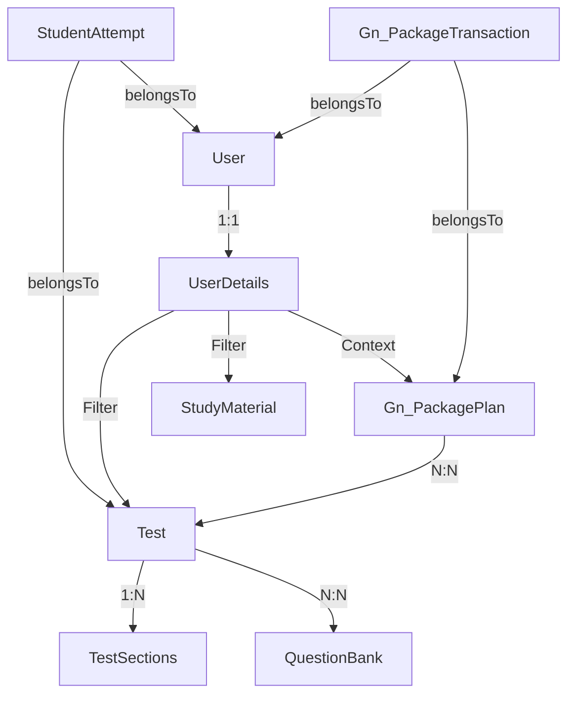

# Student Portal: Deep Structural Analysis

## Overview
The Student Portal is a comprehensive platform designed for educational engagement, allowing students to take tests, purchase exam packages, and access study materials. The portal's content is dynamically filtered based on the student's **Education Type** and **Class/Group/Exam** selected during registration.

## 1. Registration & Context Initialization
- **Component**: `App\Livewire\Frontend\Auth\Register`
- **Logic**: 
  - Students select an `education_type_id` and a `class_group_exam_id`.
  - Upon registration, these IDs are saved in the `user_details` table.
  - `education_type_id` (Education Type) and `class` (Class/Group) act as the primary keys for content filtering across the entire portal.

## 2. Student Dashboard
- **Controller**: `App\Http\Controllers\Student\DashboardController@index`
- **View**: `resources/views/Dashboard/Student/Dashboard/index.blade.php`
- **Functionality**:
  - Provides a high-level summary of the student's activity.
  - **Metrics**: Displays counts for Test Attempts, Institute Tests, and Category-based tests (Gyanology).
  - **Study Materials**: Categorized counts for Notes, Videos, GK, Comprehensive materials, etc.
  - **Filtering**: All counts are filtered using `UserDetails->class` to ensure relevance to the student's chosen path.

## 3. Test Taking System
- **Controller**: `App\Http\Controllers\Student\ExamsController`
- **Key Modules**:
  - **Listing**: `index()` lists available tests using DataTables, filtered by the student's class.
  - **Preparation**: `getTest()` provides test details and instructions.
  - **Execution**: `startTest()` handles the actual test-taking interface, loading questions grouped by sections.
  - **Result**: `showResult()` calculates marks, negative marking, and reveals the performance summary if `show_result` is enabled for the test.
  - **History**: `testAttempt()` provides a history of all submitted tests with links to results.

## 4. Plans & Package Management
- **Controllers**: 
  - `App\Http\Controllers\Student\StudentPlanController` (Purchase & History)
  - `App\Http\Controllers\Student\ExamsController@package_manage` (Package Contents)
- **Features**:
  - **Store**: `planlist.blade.php` shows available packages (Institute-specific or Global).
  - **Checkout**: Integration with **Razorpay** for secure payments.
  - **My Plans**: `myplanlist.blade.php` tracks active and expired subscriptions.
  - **Package View**: `package_manage.blade.php` allows students to browse and access the specific tests, videos, and study materials included in a purchased package.

## 5. Data Architecture

## Key Findings
- **Institute Integration**: If a student registers with an `institute_code`, they gain access to both global "Test and Notes" content and institute-specific tests/materials.
- **Dynamic Filtering**: The system relies heavily on the `education_type_child_id` (Class) field in the `test` and `study_material` tables to match content to student profiles.
- **Role-Based Access**: Middleware `is_student` ensures that only students can access these routes, maintaining clear separation from Admin and Franchise panels.
