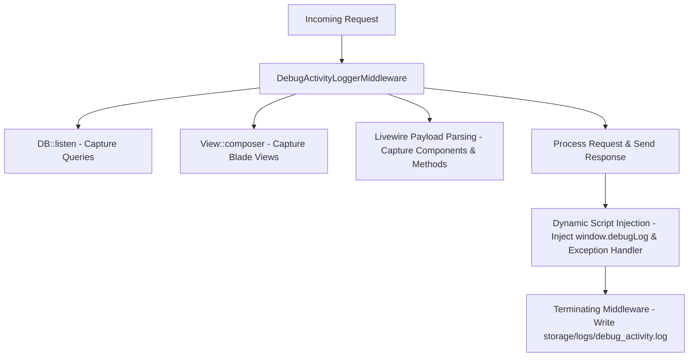

# Momin Scholar Program: Zero-Touch Local Debug Activity Logger

A high-performance, environment-aware development utility designed to capture full request/response lifecycles, Livewire actions, database queries, rendered Blade views, and client-side JavaScript crashes directly into a centralized development log file.

---

## 1. Architectural Overview

The logger operates silently as a global interceptor, capturing events at multiple layers of the application lifecycle and aggregating them at the end of each request.



### Key Highlights
* **Zero Production Overhead**: Runs *only* when `APP_ENV=local` and `DEBUG_LOGGING=true`.
* **Zero Page-Load Latency**: Writes log files inside the middleware `terminate()` hook *after* the HTTP response has already been sent to the client.
* **Unified Stream**: Merges server logs, database queries, rendering, frontend actions, and console errors into a single timestamped context stream.

---

## 2. Component Directory Structure

The system is fully integrated across the following core files in the repository:

| File path | Purpose | Description |
| :--- | :--- | :--- |
| `app/Http/Middleware/DebugActivityLoggerMiddleware.php` | **Core Interceptor** | Intercepts HTTP, parses Livewire payloads, compiles DB queries/Blade views, and injects the frontend JavaScript script. |
| `bootstrap/app.php` | **Global Registration** | Registers the interceptor at the global web middleware stack level. |
| `app/Helper/GlobalHelper.php` | **Global PHP Helper** | Exposes the typed `debug_log(string $message, array $context)` procedural function. |
| `routes/web.php` | **API Log Route** | Registers the POST `/debug-log` endpoint used by the frontend JS logger. |
| `storage/logs/debug_activity.log` | **Data Output** | The centralized output file where all session and action logs are appended. |

---

## 3. Configuration & Toggling

The logger is strictly controlled via your local environment variables to prevent accidental leaks in staging or production.

### `.env` Setup
To activate the logger, add or configure the following keys:
```ini
APP_ENV=local
DEBUG_LOGGING=true
```

To deactivate the logging system entirely, simply set `DEBUG_LOGGING=false` or change your environment to `APP_ENV=production`.

---

## 4. Feature Capabilities & Usage

### A. Automatic Server Tracking
For every HTTP request, the system automatically captures:
* **Client Metadata**: Timestamp, IP Address, HTTP Method, and full Request URL.
* **Controller Context**: Action name/class, route parameters, and input request payloads.
* **Authentication Context**: Authenticated User ID (if logged in).
* **Execution Timing**: Precise response generation duration (in milliseconds).

### B. Livewire 3 Interceptor
The middleware automatically intercepts Livewire client-to-server payloads. When a Livewire action runs, it logs:
* Target Livewire component names (e.g. `App\Livewire\Student\Tests\OnlineTestRunner`).
* Active update properties and methods called (e.g. `saveReviewAnswer`, `confirmSkipAndNext`).
* Payload parameters.

### C. Database Query Profiler
All SQL queries executed during the request lifecycle are tracked automatically:
* **Raw SQL**: Full queries with hydrated bindings.
* **Performance Timings**: Exact milliseconds (`ms`) spent by the DB engine executing each query.

### D. Blade Views List
Automatically registers view names as they render, listing every nested parent and child Blade component composed (e.g., `livewire.student.tests.test-review`, `components.layouts.student-exam-mary`).

### E. Frontend JavaScript `window.debugLog()` API
The logger dynamically injects a JavaScript snippet right before the `</body>` tag of all HTML page responses. This exposes a global helper:

```javascript
// Trigger a manual event from any frontend JS script or button click handler
window.debugLog("Clicked submission button", { testId: 4, questionsAnswered: 24 });
```

### F. Global Frontend Exception Catcher
The injected script automatically registers a listener for `window.addEventListener('error')`. Any uncaught JavaScript crash, Alpine error, or client failure will be captured, serialized, and forwarded to the server log:

```text
[2026-05-22 09:04:12] FRONTEND JS ERROR: Uncaught ReferenceError: alpineTimer is not defined
  Context: {"filename":"http://127.0.0.1:8000/js/app.js","lineno":42,"colno":12,"stack":"..."}
```

### G. Manual PHP `debug_log()` API
For developers wanting to track a specific code branch, manual logging is available globally in any PHP class, controller, Livewire component, or view:

```php
// Standard debug logging
debug_log("Successfully updated student answer", [
    'student_id' => Auth::id(),
    'question_id' => 142,
    'answer' => 'ans_2'
]);
```

---

## 5. Log Format Reference

Logs are stored cleanly inside `storage/logs/debug_activity.log` with distinct delimiters:

```text
================================================================================
[2026-05-22 09:05:04] REQUEST: GET http://127.0.0.1:8000/student/test/test-review/payload-hash
IP: 127.0.0.1 | User ID: 12
Controller: App\Livewire\Student\Tests\TestReview
Duration: 84.12ms

- DATABASE QUERIES:
  * [0.84ms] select * from `users` where `id` = 12 limit 1
  * [1.22ms] select * from `test_attempts` where `student_id` = 12 and `test_id` = 4 limit 1
  * [2.40ms] select `question_bank`.* from `question_bank` inner join `test_sections` on ...

- RENDERED VIEWS:
  * components.layouts.student-exam-mary
  * livewire.student.tests.test-review

================================================================================
```

---

## 6. Maintenance & Performance Considerations

1. **Log Rotation**: In high-velocity local testing, `debug_activity.log` can grow large. You can safely delete or truncate the file at any time.
2. **Environment Lock**: The `DB::listen` query listener and `View::composer` view parser are dynamically instantiated *only* within the active middleware scope when `DEBUG_LOGGING` is enabled, guaranteeing zero system pollution when disabled.
